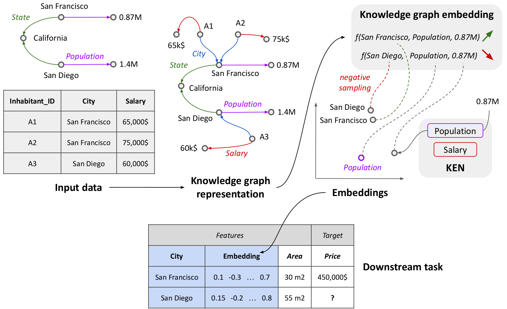

# Embeddings to Bring Background Information

In data science, we often encounter data on common entities, such as cities, companies, famous people... **Augmenting the data at hand with information assembled from external sources may be key to improving the analysis**. 

For instance, estimating housing prices benefits from background information on the location, such as the population density or the average income. This information is present in a knowledge source such as wikipedia, but assembling it across the many tables into numerical features can be tedious.

Instead, we provide readily-computed **vectorial representations of entities** (*e.g.* cities) that capture the corresponding information. 

## Visualizing these entity embeddings

*2D visualization of entity embeddings learned from YAGO3, colored by
their types. [UMAP](https://umap-learn.readthedocs.io/en/latest/) was
used to reduce their dimension from 200 to 2.*

## Downloading the embeddings

We give different tables for the embeddings of entities of various types:

* [administrative districts](assets/data/emb_administrative_district.parquet)
* [people](assets/data/emb_person.parquet)
* [artists](assets/data/emb_artist.parquet)
* [albums](assets/data/emb_album.parquet)
* [movies](assets/data/emb_movie.parquet)
* [companies](assets/data/emb_company.parquet).

# How are these embeddings built?

We represent the relational data on the entities as a **graph** and adapt
graph-embedding methods to create feature vectors for each entity. We show that two technical ingredients are crucial: modeling well the different **relationships** between entities, and capturing **numerical** attributes. For this, we leverage **knowledge graph embedding** methods. Although they were primarily designed for graph completion purposes, we show that they can serve as powerful feature extractors. However, they only model discrete entities, while creating good feature vectors from relational data also requires capturing numerical attributes. We thus introduce **KEN** (**K**nowledge **E**mbedding with **N**umbers), a module that extends knowledge graph embedding models to numerical values.

*Our proposed embedding pipeline for feature enrichment.*

We thoroughly evaluate approaches to enrich features with background information on 7 prediction tasks. We show that a good embedding model coupled with KEN can perform better than manually handcrafted features, while requiring **much less human effort**. It is also competitive with combinatorial feature engineering methods, but is much more **scalable**. Our approach can be applied to huge databases, creating **general-purpose feature vectors reusable in various downstream tasks**.

## Embeddings the data in Wikipedia

To build embeddings that capture the information from Wikipedia we leverage [YAGO3](https://yago-knowledge.org/downloads/yago-3), a large knowledge base derived from Wikipedia, and apply our embedding pipeline to generate vectors for many entities. These pretrained embeddings are readily available in parquet files that you can download [here](#downloading-entity-embeddings).

### YAGO3 and its embeddings
YAGO3 is a large knowledge base derived from Wikipedia in multiple languages and other sources.
It represents information about various entities (people, cities, companies...) in the form of a knowledge graph, *i.e.* a set of triples *(head, relation, tail)*, such as *(Paris, locatedIn, France)*.
Overall, our version of YAGO3 contains **2.8 million** entities, described by **7.2 million** triples (including 1.6 million with numerical values, such as city populations or GPS coordinates).

We learn 200-dimensional vectors for these entities, using as knowledge-graph embedding model MuRE (Balažević *et al.*, [2019](https://arxiv.org/abs/1905.09791)), which we combine with KEN to leverage numerical attributes.

